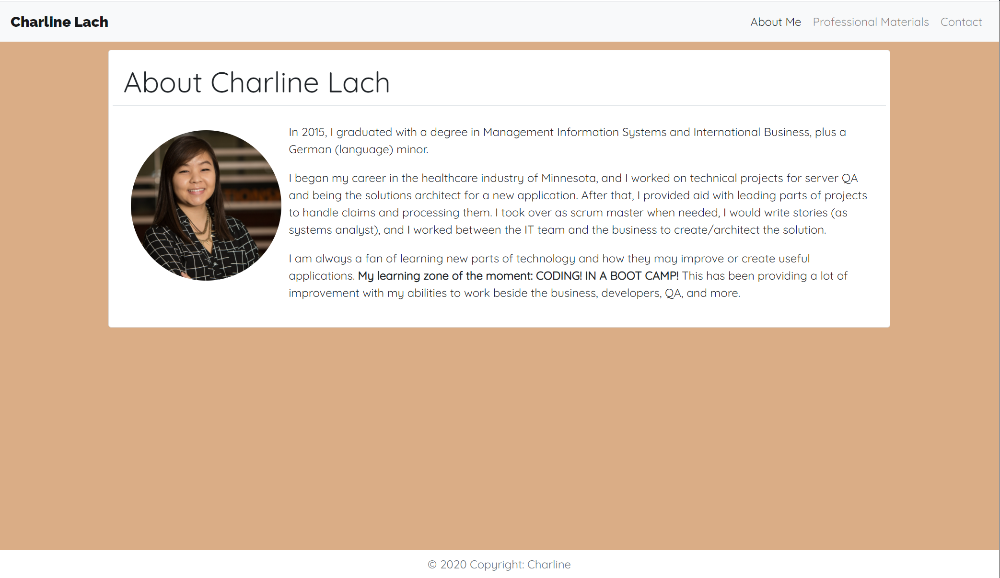
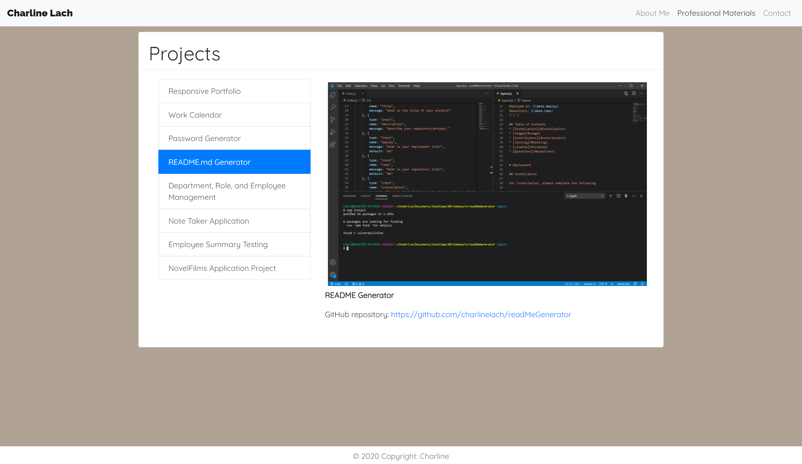
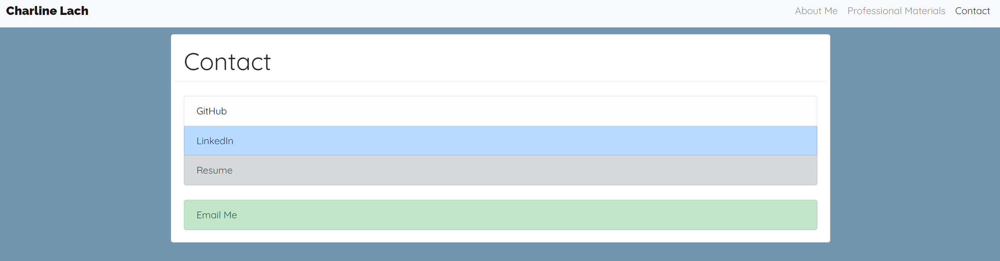

# Responsive Portfolio
The initial purpose of this project is to test/provide practice for the developer in coding with CSS and Bootstrap.
 
The third motion of this application was to improve its input, to provide professional materials (as if applying to developer roles), to supply contact information to recruiters. It provides links to great resources about the creator and many projects.

**Latest Update**: `2020 November 05`
 
Deployed at: https://charlinelach.github.io/responsivePortfolio/
 
Repository: https://github.com/charlinelach/responsivePortfolio
 
**Created**: `2020 September 22`

# Development

## Usage Instructions
To utilize this website/application, end users may access it via [deploy link](https://charlinelach.github.io/responsivePortfolio/). From this website, there are three pages: About Me, Professional Materials, and Contact. About Me provides a light summary of the creators interest. Professional Materials gives a list of great projects created by the coder. The Contact page offers ways to contact - GitHub, LinkedIn, and Email. The Contact page also provides a current resume.
 

 

 

 

## Installation Instructions
N/A

## Credits & Thank Yous
Shout out to the wonderful instructor and TAs!
 
Thank you to the grader of the initial application. Reading the comments helped me understand how to improve.

# License Information
MIT License  
Copyright (c) 2020
